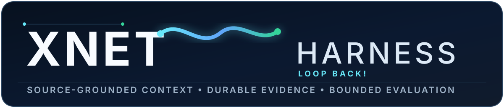
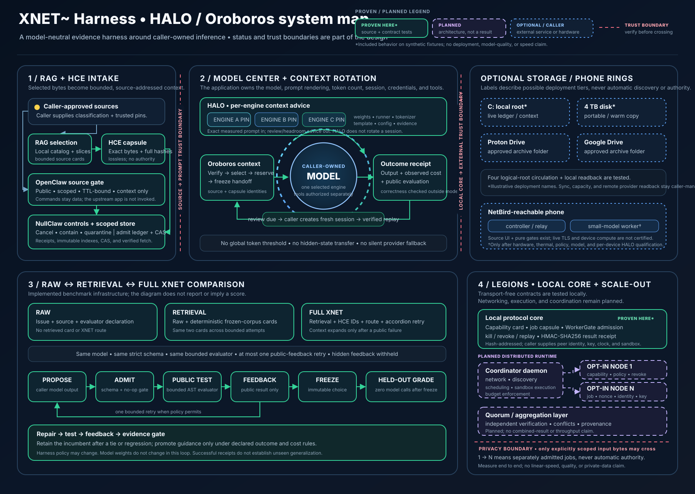

# XNET~ Harness

[](docs/architecture-map.md)

**XNET~ — LOOP BACK!**

**Source-grounded context. Durable evidence. Bounded evaluation.**

XNET~ Harness is a model-agnostic harness for source-backed context, durable evidence and bounded evaluation. Applications keep control of their model processes, credentials, tools and sessions. The harness supplies versioned data contracts and local utility components that those applications can use.

**Oroboros** describes the context circulation and handoff structure. **HALO** means Hash-Addressed Long-context Observation: the evaluation and calibration layer used to test that structure. **HCE** means Hash-Addressed Capsule Encoding: the lossless, source-bound wire format used to move selected bytes through those layers.

## Release scope

This initial source release focuses on reusable local foundations:

- Canonical event records, a hash-chained ledger and content-addressed storage.
- HMAC-authenticated scope manifests and explicit action admission.
- Full-hash HCE source capsules, immutable indexes and derived display faces.
- HALO advice bound to one caller-attested engine configuration.
- Strict extraction-only curator admission and inactive source-pinned calibration observations.
- A bounded inert code-repair evaluator and caller-owned repair loop.
- A strict adaptive repair contract in which the model proposes changed-file replacements while the harness owns bundle assembly, provenance, HCE metadata and grading.
- Validation-gated procedural memory and promotion-gated scaffold guidance.
- A resumable `LearningEpoch` that borrows caller-supplied callbacks.
- Source-only storage circulation and optional application adapters.
- A durable outer loop, public archive projection and authenticated caller-owned Start/Stop controls.
- Jcode history/session/learning peers, offline bridge admission and mobile proof enrollment.
- Finite home practice, exposure accounting and source-integrity cost controls.
- Verified context packets and literal citation checks for explicitly selected local providers.
- Public synthetic examples and utility tests.
- An optional Rust fabric, runtime, SDK and private-stdio CLI.

HMAC authentication in this release uses a shared secret. It is not a digital
signature, does not distinguish among holders of that secret, and provides no
nonrepudiation.

The Python and Rust ledgers use separate roots and formats. They are independent implementations; importing one does not migrate or merge the other.

Applications supply model runners, Jcode, hosted providers, cloud clients, phone transport and resident scheduling. The included libraries do not provision those services or bundle model weights. The [coverage appendix](docs/coverage.md) identifies included interfaces and remaining portable service work. Utility checks establish contract behavior on their fixtures.

Generic peers in this public configuration are named `operator`, `assistant` and `peer`. Use new designated roots. This release provides no migration of private operational roots or frozen evidence.

## Architecture map

[](docs/architecture-map.md)

The [annotated system map](docs/architecture-map.md) separates source and contract-tested release code from optional caller-managed integrations and the planned Legions scale-out design. The status legend is part of the claim boundary.

## Quickstart

This is a source-checkout distribution. Use Python 3.11 or later in a virtual environment. From the checked-out repository:

```sh
python -m pip install -e .
python -m unittest discover -s tests
```

The project metadata names the package `xnet-harness`; Python imports and the CLI command use `xnet`. Existing schema and protocol identifiers retain their `xnet` and `xnet.*` spellings. Editable installation from the source checkout is supported. A standalone wheel or PyPI release is not supported in this release. Its core uses the Python standard library.

Keep the checkout structure intact. Sphere circulation verifies its implementation together with adjacent reviewed files under `scripts/` and `adapters/`. Optional native session adapters also need the matching SDK and reviewed native binary selected by the caller.

This example runs entirely in memory, preserves the exact source bytes and checks both full hashes:

```python
from xnet.hce_capsule_v1 import decode_capsule, encode_capsule
from xnet.protocol import sha256

source = "The service accepts empty inputs.\n".encode("utf-8")
wire = encode_capsule(
    source,
    expected_source_sha256=sha256(source),
    ring=1,
    kind="note",
    classification="public",
)
capsule = decode_capsule(wire, expected_sha256=sha256(wire))
assert capsule["text"].encode("utf-8") == source
print("Source round-trip verified.")
```

For persistent capsules, `HceCapsuleStore` borrows an initialized caller-owned `Ledger` and a mandatory scope gate. The caller selects the storage root, source classification and task. See [Oroboros](docs/oroboros.md).

### Optional Rust workspace

With a Rust toolchain installed:

```sh
cargo test --manifest-path rust/Cargo.toml
cargo run --manifest-path rust/Cargo.toml -p xnet-cli -- version
```

The native runtime owns its designated local root. Its daemon communicates over private standard input/output; applications own its process lifecycle. See [architecture](docs/architecture.md).

The optional `xnet-hce` crate implements a lossless codec and `xnet-halo` validates per-engine advisory calibration records. They do not replace the Python Ledger/CAS authority, change a runtime protocol or migrate persistence. See [native HCE and HALO](docs/native-hce-halo.md).

## Native first, interchangeable models

| Route | Intended user | Current source support |
|---|---|---|
| Apple on-device system model | Everyday iPhone users | SwiftUI source app, protected local source cards, verified packet/citation utilities and a source-only bridge; Swift/device acceptance remains required |
| Qualified phone-local 4B | Builders with a measured compatible iPhone | Backend seam planned; no model, tokenizer or phone runner is bundled, and each device needs its own fit and HALO evidence |
| Paired home 4B then 14B | Users who explicitly send harder work to their own computer | Strict protocol, pure gateway gate and Swift client/UI source are present; the TLS listener, trusted receipt stores and model dispatcher remain caller-owned and unvalidated end to end |
| Available on-device Windows AI | Everyday Windows users | Verified packet/citation utilities and source-only bridge references; native app/device acceptance remains required |

The same source context can support each route. The optional phone-local BYOM lane remains `xnet-4b`. The distinct remote-host wire stays Apple native, `home-4b`, then `home-14b`; `xnet-4b` is never accepted or silently normalized on that wire. Route changes are explicit, and private context never crosses devices as a silent fallback. Apple's supported Foundation Models API and Microsoft's Windows AI API are developer interfaces; the installed consumer Copilot app does not establish a local inference endpoint.

Keep full sources in the local store, select small relevant passages, and pass source IDs and complete hashes with the context. The model window receives a bounded view; archived detail remains retrievable. Source integrity and a valid quote do not verify all the answer's semantic claims. Missing evidence should be reported explicitly and scored independently.

Start with local disk; an approved Proton Drive archive is optional. See the [minimum Oroboros blueprint](docs/minimum-oroboros.md), [native API/build guide](docs/native-intelligence.md), and [iPhone source app](examples/native/apple/README.md). The Swift/C# sources have not been compiled or validated on devices. No native SDK, model download or silent cloud fallback is installed by this package.

## How the layers fit

| Layer | Responsibility |
|---|---|
| XNET~ Harness | Typed data, local evidence, scope admission and reusable utility interfaces |
| Oroboros | Preserve sources and prepare bounded context for a caller-owned handoff |
| HALO | Measure context behavior and propose a configuration-specific review margin |
| Model or agent application | Render prompts, count actual tokens, perform inference and authorize tools |
| Storage or transport adapter | Move selected objects and independently verify destinations |

A digest verifies bytes against a supplied expected digest. Authorship, permission and semantic correctness require separate checks. Context data carries no tool authority.

## Learning and evaluation

Harness learning means evaluating changes to retrieval, guidance, routing or retry policy and retaining only changes that pass a declared promotion rule. It does not update neural weights.

`RepairLoop` asks a caller-supplied generator for proposed changes and evaluates candidate code as bounded AST data. It detects no-op changes, retains completed responses and freezes final choices before held-out grading. This evaluator implements a restricted language; it is not a general Python runtime or an official repository benchmark runner.

`AdaptiveRepairContract` gives a caller-owned model transport a task-specific strict JSON Schema and accepts only changed-file replacements plus a declared lesson identifier. XNET~ Harness merges those replacements into the frozen source bundle, rejects unknown fields, duplicate paths and semantic no-ops, and stamps the proposal with harness-owned hashes and provenance. Candidate modules never enter Python's import system; evaluation stays inside the bounded AST linker/interpreter. See the [adaptive repair contract](docs/adaptive-repair-contract.md).

`ProceduralMemory` stages source-backed notes and procedure cards for independent public validation before activation. `ScaffoldLearner` compares guidance against a baseline under declared solve and cost rules. `LearningEpoch` composes proposal, practice, validation, promotion and trace stages using caller-supplied generation, proposal and boundary-observer callbacks. It is resumable and bounded per call; the application supplies any resident scheduler.

`LearningEpoch` retains original task/reference material in a designated private local ledger. Keep that root out of public exports and cloud circulation. Only the approved public projections may enter learner context.

Keep practice and evaluation tasks separate. Freeze choices before held-out grading. Record the actual context exposed, model configuration, retries, retrieval cost and inference cost. Retaining the baseline after a tie or regression is a valid result.

### Spent 4B regression board

Hash-identified private pilot evidence records two results for a fixed-weight 4B lane on a spent dojo/regression board: one single sealed victory-lap run resolved all hidden cases for 7/8 tasks, while successful receipts across separate sealed evidence chains cover all 8/8. Terminal-histogram was chain-sensitive and bimodal; its successful chain required the exact card plus a retry carrying the concrete crash trace. This supports only closure of a previously used board, not unseen generalization or an official SWE-bench result. Blind Repair 50 remains the transfer benchmark; the current Vulkan run is separate from this pilot evidence. See the [Epoch 3 evidence note](docs/epoch3-4b-regression-board.md) for provenance and claim boundaries.

HALO has no globally active token threshold. A caller must attest the actual engine, tokenizer, template, configuration and current rendered prompt before adopting a calibration. Recall tests and reasoning tests must be reported separately. See [HALO](docs/halo.md).

### Blind Repair 50 transfer result

The first frozen transfer run did **not** show an accuracy uplift from the full harness. On the custom, synthetic, SWE-style Blind Repair 50 battery, the raw 4B arm solved 32/50 tasks, retrieval-only solved 27/50, and full XNET~ solved 29/50. Full XNET~ gained three tasks that raw missed and lost six tasks that raw solved, for a net difference of -3. It beat retrieval-only by two net tasks.

| Frozen arm | First attempt | Final | Calls | Retries | Recorded tokens |
|---|---:|---:|---:|---:|---:|
| Raw 4B | 29/50 | **32/50** | 65 | 15 | 55,133 |
| Retrieval only | 22/50 | **27/50** | 75 | 25 | 70,075 |
| Full XNET~ | 24/50 | **29/50** | 72 | 22 | 69,856 |

All 150 choices were frozen before the hidden suite opened, grading made zero model calls, and the leakage check reported zero violations. One reset transport was conservatively recorded as a zero-credit HTTP-style 599 result and was never redispatched. Retrieval's 70,075 recorded tokens cover 74 of 75 calls; the failed call has unknown provider usage, so the benchmark's telemetry-completeness and token-ratio gates failed. This is a project benchmark, not official SWE-bench, and it does not establish parity with flagship models. The negative result is the baseline for improving routing, retrieval selectivity and retry policy. See the [protocol and receipts](docs/blind-repair50.md) and [v0.1.0 release notes](docs/release-notes-v0.1.0.md).

## Scale-out contracts and updates

The optional [Legions contract](docs/legions.md) admits bounded assignments only when the embedding application supplies a caller-authenticated coordinator identity, produces HMAC-authenticated result receipts, and refuses replay, expiry, backdating and capacity exhaustion. It is a contract core; this release does not include a network daemon, remote command execution, scheduler, quorum or compute marketplace.

The [component update center](docs/update-center.md) inventories XNET~ and pins Jcode v0.91.0 by release identity and artifact hash. `xnet updates inventory` reads the reviewed local registry without network or process access. A caller may supply its own bounded fetcher for a read-only release check. The v0.1.0 audit disabled staging, apply and rollback before release; installation remains operator-owned, and nothing silently downloads, installs or executes.

## Documentation

- [XNET Code and the Jcode lineage](docs/xnet-code.md)
- [Visual HALO / Oroboros system map](docs/architecture-map.md)
- [Architecture and integration boundaries](docs/architecture.md)
- [Oroboros source and handoff contracts](docs/oroboros.md)
- [HALO calibration and evidence requirements](docs/halo.md)
- [Curator intake contract](docs/curator-contract.md)
- [Adaptive repair contract](docs/adaptive-repair-contract.md)
- [Native HCE and HALO contracts](docs/native-hce-halo.md)
- [Release verification and reproducible checks](docs/verification.md)
- [Reported pilots and claim boundaries](docs/reported-pilots.md)
- [Epoch 3 fixed-weight 4B regression-board evidence](docs/epoch3-4b-regression-board.md)
- [Blind Repair 50 protocol and claim rules](docs/blind-repair50.md)
- [v0.1.0 release notes](docs/release-notes-v0.1.0.md)
- [Eight-day build timeline](docs/build-timeline.md)
- [Component inventory and read-only update checks](docs/update-center.md)
- [Legions authenticated assignment contract](docs/legions.md)
- [Development goals and contribution opportunities](docs/development-roadmap.md)
- [Portable harness coverage](docs/coverage.md)
- [Native Apple/Windows interfaces](docs/native-intelligence.md)
- [iPhone source app](examples/native/apple/README.md)
- [Local drive and optional Proton blueprint](docs/minimum-oroboros.md)
- [Draft Jcode context-provider proposal](docs/upstream-proposal.md)
- [Contributing](CONTRIBUTING.md)
- [Security policy](SECURITY.md)

## Credits

Original XNET~ Harness code in this repository is authored by **Felix Xavier Lopez**. Third-party code and referenced projects retain their original authorship and licenses; see [Third-party notices](THIRD_PARTY_NOTICES.md).

[](docs/build-timeline.md)

## License

XNET~ Harness is released under the [MIT License](LICENSE). Preserve applicable third-party notices when redistributing code. Models, runners and external applications retain their own licenses.
