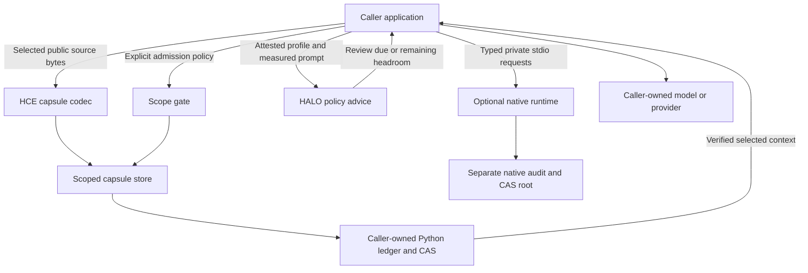

# Architecture

XNET is a utility peer to an agent application. It owns local evidence and context contracts. The application owns the worker model, session, credentials and tool decisions. Jcode can be one such application; XNET does not require Jcode.

The [status-aware HALO / Oroboros system map](architecture-map.md) shows these boundaries together with the repair comparison, optional storage and phone rings, and the planned Legions panel.

## Component boundaries

| Component | Owns | Caller supplies |
|---|---|---|
| `protocol` | Canonical serialization and hash functions | Values and expected identities |
| `Ledger` | Local event chain and evidence storage | A designated data directory |
| `ScopeAuthority` | HMAC-authenticated manifests and admission checks | Authorized assets, methods and policy capture |
| `HceCapsuleStore` | Full-hash source records and immutable indexes | Existing ledger, mandatory gate, scope and task IDs |
| `HaloPinRegistry` | Explicit in-memory policies and advice | Attested engine identity, evidence pins and current occupancy |
| `RepairLoop` | Durable attempt records and bounded inert evaluation | Reviewed generation callback, tasks, references and run identity |
| `ProceduralMemory` | Staged and validated source-backed procedure cards | HMAC-authenticated scope, source evidence and independent public validation |
| `ScaffoldLearner` | Frozen guidance selection and promotion records | Public verifier outcomes, disjoint tasks and cost policy |
| `LearningEpoch` | Resumable bounded epoch stages | Dataset and artifact pins, generation/proposal callbacks and boundary observer |
| Native fabric and SDK | Versioned request/response encoding | Transport and process ownership |
| Native runtime | Its own CAS and audit stream | A separate designated root |

The current HMAC-authenticated records use shared secrets. They are not digital
signatures, cannot distinguish which key holder created a record, and provide
no nonrepudiation.

Creating a `Ledger` initializes storage. The caller must authorize that initialization before handing it to a scoped adapter. A scope callback must enforce policy; passing a callback that always allows operations removes that protection.

## Source context

The HCE wire format binds source bytes and capsule metadata with complete SHA-256 identities. Display faces are deterministic renderings of that record. Source text remains data when an application renders it into a prompt. Applications must escape plain text for HTML and keep retrieved source separate from tool instructions.

The public HCE adapter accepts explicitly selected `public` sources. That label is a caller declaration, so classification still needs a caller review. Hashes do not classify secrets automatically.

## Independent runtimes

Python uses a SQLite ledger and its own CAS. The Rust runtime uses a separate native audit stream and CAS. Their identities and roots stay separate. Any exchange between them needs a versioned adapter and explicit verification.

The native daemon uses private standard input/output. An application starts and stops it, selects peers and manages callbacks. Native context operations do not load a model or invoke a provider.

## Optional integration seams

Source adapters and session controllers can compose these primitives. Included adapters are separate peers; their presence does not establish a running Jcode process, hosted provider, model runner, cloud service or mobile connection. Those live integrations require their own documented contracts and transport tests. A feature name in a diagram does not establish an active integration.

The source checkout is the supported distribution boundary. An editable install retains access to adjacent reviewed scripts and adapters. Sphere circulation verifies those sources and cannot be deployed by copying only the Python package. No standalone wheel or PyPI deployment is supported by this initial release.

New public configurations use generic peers `operator`, `assistant` and `peer`. Initialize new designated roots rather than reopening private operational state. No migration of old roots, identities or frozen evidence is supplied.

Storage transport has three distinct checks: verify source bytes, verify destination bytes, and prove retrieval through the destination provider. Reading a desktop sync folder establishes only the local file check. A remote provider verification requires an authenticated retrieval through that provider.

## Bounded repair and harness learning

Generated candidate code remains data for the restricted AST evaluator. The repair loop does not import it into the host interpreter. Supported language constructs and explicit limits determine which tasks the evaluator can admit; unsupported imports or general Python behavior need a different isolated evaluation backend.

Procedural memory stages source-backed cards and requires independent public validation before activation. Scaffold learning binds observed guidance to public verifier outcomes, freezes selections and applies a declared promotion rule on disjoint tasks.

`LearningEpoch` borrows source-pinned generation, proposal and boundary-observer callbacks. It owns neither transport nor model lifecycle. The observer must supply the exact host-boundary evidence required by the epoch contract. Each `step` or bounded `run` advances explicitly; any persistent scheduler belongs to the caller.

Original tasks and references remain private local inputs and are retained in the epoch's designated private ledger. They must never join public or cloud exports. Public failure projections and sealed policy traces can be selected separately.

## Evaluation boundary

Utility tests check protocol and storage behavior. Model tests require an independently identified runner, actual prompt occupancy, frozen public inputs, retained outputs and a declared grader. The initial release provides no guaranteed capability uplift or universal context limit.
