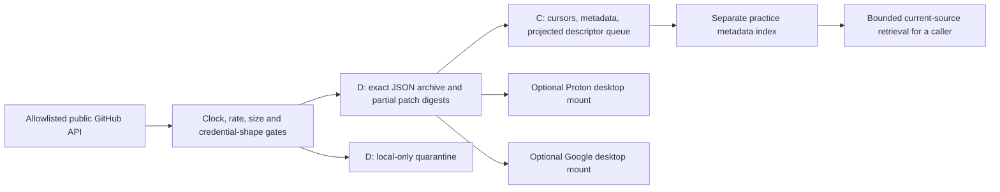

# XNET public practice feed

This is a background acquisition and circulation utility. It makes **zero model calls**. Its practice stream is kept separate from workspace and evaluation data. Reading a feed or saving a patch does not certify an answer, promote a lesson, train weights, or improve a score by itself.



The hot metadata and control database belong on C or another chosen fast local disk. Digests and exact public bodies can live on the portable D archive. Clouds copy in the background; model calls never query them through this engine.

## Acquisition contract

- Anonymous direct TLS to `api.github.com`; no environment token, proxy, cookie jar, authorization, redirects or blind retries.
- Exact allowlist: `tokio-rs/tokio`, `golang/go`, `ziglang/zig`, `JuliaLang/julia`, `python/cpython`.
- Once per hour, request one latest-commit listing per repository. Fetch its immutable 40-character commit only if that repository's cursor changed. Typical cost: 5 requests when unchanged, at most 10 when every repository changed. Durable requests, including failures, are bounded to 16 in a rolling local UTC hour.
- A 15-second monotonic deadline bounds each direct TLS request; acquisition has a 240-second cycle deadline. Bodies are capped at 2 MiB. Retry-After and rate-reset headers create a durable hold instead of an automatic retry.
- UTC timestamps are paired with a process monotonic anchor. A backward checkpoint or clock/monotonic mismatch holds acquisition and appends a clock-anomaly receipt. Local time is not presented as trusted time consensus.
- Exact JSON bodies are content addressed. At most 32 changed-file patch fields per commit are projected; each UTF-8 snippet is at most 4 KiB. Every snippet is explicitly partial, with unknown GitHub completeness; no complete before/after source is claimed.
- Credential-shaped public payloads are quarantined locally before projection or mirroring. Shapes are conservative and may yield false positives; this is not a guarantee that every possible secret will be recognized.
- Upstream paths, repository, commit, language, canonical source URL, digest and license-retention notice travel with each projection. Own control code is MIT. Upstream content keeps its upstream license.

The archive has a fixed 256 MiB quota and file-count bound. A full/corrupt archive holds acquisition; nothing is automatically deleted or silently repaired. C metadata uses durable SQLite cursors, request reservations and a hash chain. One OS writer lease protects the process. Existing namespaces with different identity/config/source pins are refused.

## Sync proof

Only this engine's sealed file manifest is eligible for sync. Local-only quarantine is excluded. The engine does not scan existing vaults, read cloud content as model context, heal or overwrite differing cloud bytes. Newly copied files are read back and hash verified. An absent parent mount stays absent. An unidentified nonempty mirror root is refused.

This proves **desktop mount readback**. It does not prove that the provider uploaded bytes, that a remote server retained them, or that an iPhone retrieved them. The sealed synchronization receipt is itself copied on the next cycle, so cloud mirror heads can trail the local chain by one checkpoint.

## Portable initialization

Paths are explicit runtime choices; no operator-specific paths or credentials are baked into the source. Python 3.12 standard library is sufficient. The optional mirrors can be omitted for local-only operation.

```powershell
$python = 'C:\path\to\python.exe'
$source = 'C:\path\to\feed_engine'
$config = 'C:\path\to\xnet-runtime\feed-config.json'

& $python -B "$source\feed_engine.py" init --config $config `
  --control 'C:\path\to\xnet-runtime\control' `
  --archive 'D:\XNET\halo-code-feed-r01' `
  --proton 'C:\path\to\Proton Drive\oroboros\halo-code-feed-r01' `
  --google 'G:\My Drive\XNET-PRIVATE\oroboros\halo-code-feed-r01'
```

Create/confirm the intended archive parent and existing cloud-client parent mounts before the first run. Initialization writes only the explicit configuration; acquisition starts only with `once` or `run`. Copy the three control files together and initialize after copying, because source pins are computed in the installed package. `main(argv=None)` also supports a package dispatcher.

### Manual one-cycle gate

```powershell
& $python -B "$source\feed_engine.py" once --config $config
& $python -B "$source\feed_engine.py" verify --config $config
& $python -B "$source\feed_engine.py" status --config $config
```

Inspect `control\last-cycle.json`: acquisition and every explicitly configured local mirror must be ready. All descriptors are in `control\projected-descriptors.json`. A second immediate cycle performs no fresh HTTP acquisition. A paused feed performs no acquisition.

### Standard-user start and stop

```powershell
& "$source\feed_control.ps1" -Action Start -PythonPath $python -ConfigPath $config
& "$source\feed_control.ps1" -Action Status -PythonPath $python -ConfigPath $config
& "$source\feed_control.ps1" -Action Stop -PythonPath $python -ConfigPath $config
```

Start launches a hidden owned Python process and validates PID, process start time, executable/source hashes, config and generation. Stop records a pause and generation-specific cooperative STOP. There is no force kill or global process stop. A normal network request can delay cooperative stopping up to its bounded deadline. A deliberate Start revokes pause; scheduled cycles obey pause.

### Manual-first hourly task

```powershell
& "$source\schedule_feed.ps1" -Action Prepare -PythonPath $python -ConfigPath $config
Start-ScheduledTask -TaskName 'XNET Halo Code Feed r01'
# After inspecting the successful manual cycle:
& "$source\schedule_feed.ps1" -Action Enable -PythonPath $python -ConfigPath $config
& "$source\schedule_feed.ps1" -Action Status -PythonPath $python -ConfigPath $config
```

Prepare creates this unique owned task with no automatic trigger. Enable requires a successful manual receipt and all configured mirror readbacks, then adds hourly repetition. The current logged-in user runs at `Limited`, with no saved password; a hidden PowerShell action invokes one bounded cycle. Task policy may reject registration for a standard user; report that limitation without changing machine security or escalating. A continuously running writer keeps the lease; another scheduled cycle refuses concurrent ownership. No Kimi task is modified.

## Index seam

### Observable native host

The source checkout also supplies `scripts/loopback-host.ps1`. It records each
native task cycle, checks task history against its receipt before enabling an
hourly trigger, and supplies identity-bound Start, Stop and Status actions.
Use one scheduling mode at a time; a resident writer and hourly task must not
share the same root concurrently.

```powershell
$hostScript = 'C:\path\to\xnet-harness\scripts\loopback-host.ps1'
& $hostScript -Action Prepare -PythonPath $python -ConfigPath $config -SourceRoot $source
Start-ScheduledTask -TaskName 'XNET Loopback Hourly r01'
# Inspect the successful native task receipt before enabling repetition:
& $hostScript -Action Start -PythonPath $python -ConfigPath $config -SourceRoot $source
& $hostScript -Action Stop -PythonPath $python -ConfigPath $config -SourceRoot $source
```

Place configuration and control state in a path visible to both the application
and native Windows tasks. Packaged apps can redirect AppData into a private
filesystem view. One recorded setup hit that boundary; a fresh shared-C root
preserved the predecessor, cursors and hourly request limits before a successful
native run. Registering a task alone does not prove it can read its configuration.

Every projected descriptor has exactly the `xnet.metadata-source.v1` fields expected by `stream_index.py`: scope/task/source IDs, adapter `archive-d`, relative path, repository, commit revision, source hash/size, language/family/tags, `provenance=practice-stream`, and intake-receipt hash. Root may validate with `source_descriptor(**descriptor)` and admit it into a separate practice-only `MetadataIndex`. Acquisition does not admit data into evaluation or promote lessons automatically.

The JSON provenance wrapper in D adds upstream path/URL, partialness, license retention and explicit false model-training/promotion/evaluation flags. The C queue is metadata only. The caller controls retrieval, verification and accuracy gates.

## Offline verification

```powershell
# Run from the XNET source checkout; no live acquisition occurs.
& $python -B -m unittest discover -s tests -p test_loopback_feed.py -v
```

Tests use fake GitHub API replies, disposable local directories, fake clocks and monkeypatched TLS. They cover source/config drift, bounds, per-repo cursors, quota, replay/dedup, writer exclusion, local mounts, corruption/no-overwrite, immutable commit identity, credential quarantine, clock rollback/deadlines, optional clouds, no environment secrets, direct TLS and redirect refusal. Offline checks do not certify live API access, native task registration, background start/stop, remote upload or model improvement.
