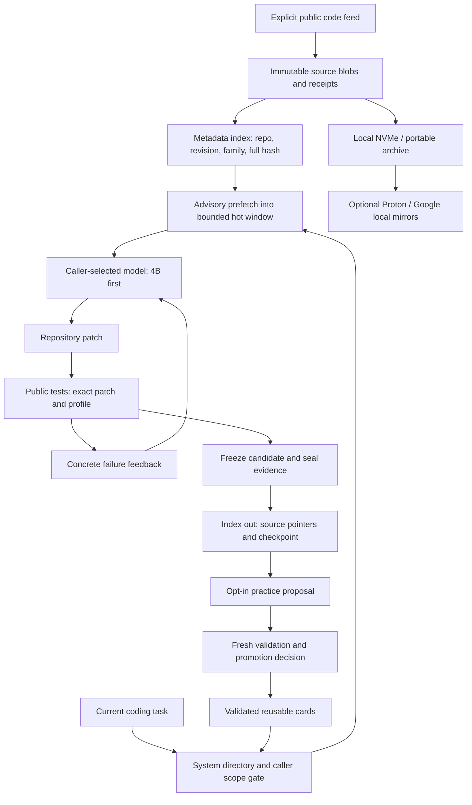

# XNET~ Loopback

**LOOP BACK! — prepare sources while the model is idle; review repairs before accepting them.**

Loopback gives the intervals between requests useful work. A public feed gathers source changes, metadata locates a likely task family, and a bounded hot window holds verified passages. The caller starts the model when work arrives. A separate review stage checks the resulting repair. Loopback does not change wall-clock time or model weights.



The diagram describes interfaces. The status directory and run receipts establish which interfaces a particular run actually used. Adding a file or a card does not establish activation, correctness or a score gain.

## One checkout

```sh
git clone https://github.com/perishably/xnet-harness.git
cd xnet-harness
python -m pip install -e .
python -m xnet loopback --help
python -m xnet loopback index demo --root runtime/first-loopback-demo
python -m xnet loopback catalog --command query --query "hce halo rag"
```

The demo uses three synthetic public source files, no network and no model. It indexes metadata without reading source content, prewarms a relevant file, retrieves a verified slice from the hot window and checkpoints its ledger. Use a new root for each demo.

## Master directory

The directory lists source paths, hashes, languages, callable contracts, scopes, side effects and evidence pointers. Agents query this directory before choosing tools. Selection is discovery; the caller still verifies the current source and admits the action through its own scope gate.

Statuses distinguish `implemented`, `wired`, `verified`, `inactive`, `pending` and `evidence`. A verified utility is not necessarily running, and an offline contract test is not a model capability result. A changed source hash invalidates the old evidence binding.

The optional Rust `xnet-system-index` crate and the Python catalog share a closed JSON discovery protocol. The Jcode peer forwards discovery requests. Existing Rust, Go, Zig and Julia components retain their own lifecycles; discovery does not execute or silently merge them.

## Predictive retrieval

Metadata carries an exact repository revision, source digest, provenance class and task family. A prefetch is a proposal. The source must be read through an explicitly configured mount and match its digest before it enters the hot window.

Only hot data enters the foreground slicing path. A cold miss stays a miss until an explicit fetch occurs. Full sources remain available for exact review. Superseded revisions invalidate old proposals and evict their hot slices. Identical source ranges are emitted once while retaining all provenance aliases.

QR-style tags are text locators such as `xnet://sha256/<full-digest>`. Image pixels do not enter the prompt. A locator grants no permission and verifies no semantic claim by itself.

## Feed and drive circulation

The feed acquires public GitHub commit metadata and bounded changed-file patch snippets. It makes no model calls. Snippets are explicitly partial, retain upstream provenance and are practice material. They are not official evaluation context or automatically promoted lessons.

Each engine has one owner, durable request reservations, a finite quota, a cooperative stop control and sealed checkpoints. UTC labels events; a monotonic clock measures intervals. A clock jump is recorded and cannot erase a request budget. The anonymous GitHub limit is shared by the public IP; the engine's own cap does not reserve capacity from other applications. See [GitHub rate limits](https://docs.github.com/en/rest/using-the-rest-api/rate-limits-for-the-rest-api).

Optional drive adapters copy only the engine's own sealed files to explicitly selected new mirror roots and verify the destination bytes. A local Proton or Google copy is not proof that its desktop client completed a remote upload. Existing rings, credentials, model files and other applications' scheduled jobs are not managed by this feed.

The native hourly r02 host is now verified and enabled on a shared native-visible C control root. Owner-specific Stop and Start were tested; 82 files were copied and read back on each configured local cloud mount. These controls operate only the feed and do not start a model. The first r01 live cycle remains separate evidence: five repositories, 22 partial snippets and 75 files per local mount in 8.735 seconds, with zero model calls. Neither observation proves remote upload.

## Accuracy review

The repository preview reviews changed candidates and the final candidate with a fixed public test profile. Same-patch reviews replay their existing receipt. Tests consume active time and real worker dispatches. A missing, late, uncertain, timed-out or incompletely cleaned-up test cannot become a pass.

This is a repository controller preview, separate from the restricted DSL evaluator already released. It requires caller-owned generation, measured token counting and an isolated test worker. Official SWE-bench also requires repository-specific evaluation; the in-house practice board is not interchangeable with it. See the [official evaluation guide](https://www.swebench.com/SWE-bench/guides/evaluation/).

The spent r03 development diagnostic completed with **3/9 public assertions**, **11 model calls**, **362.656 seconds** and **acceptance=false**. It used one previously examined task and has no paired baseline or official benchmark claim. Public feedback could rotate out of the prompt while its compact summary retained only failure status. An optional source-bound feedback-trace context extension passed ten offline checks; a further private spent diagnostic is in progress, with no new result published. External feed-context admission into the lab remains unwired. See the [development evidence](loopback-development-evidence.md) and [historical preview acceptance detail](../lab/accuracy_preview/EVIDENCE.md).

Publication checks remain distinct: the full Python run discovered 767 tests, with 731 passes and 36 native-only skips in 428.203 seconds. Wheel verification checked 13 payload paths and six retained licenses. Clean Rust CI remains pending after the local linker dependency issue.

## Learning boundary

Practice streams can suggest retrieval or procedure cards. Fresh validation decides whether to promote them; ties and regressions retain the baseline. The model's weights remain unchanged. Repeated retrieval, a successful repair and durable memory are distinct observations. No component guarantees 98%, zero hallucinations or government certification.

The official Ornith 9B model can be selected by a caller as a practice teacher. Its model and runtime are obtained separately under their upstream terms. A teacher proposes inspectable procedures; it receives no protected evaluation answers and cannot bypass the promotion gate. XNET does not claim to reproduce Ornith's weight training or outperform it without a matching comparison.
